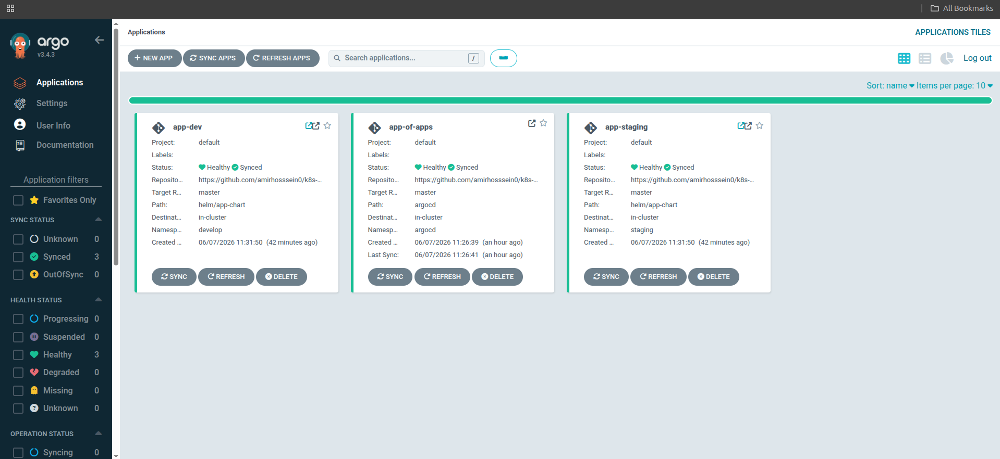
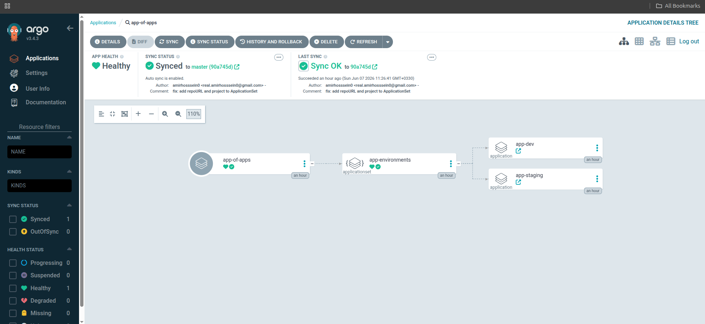
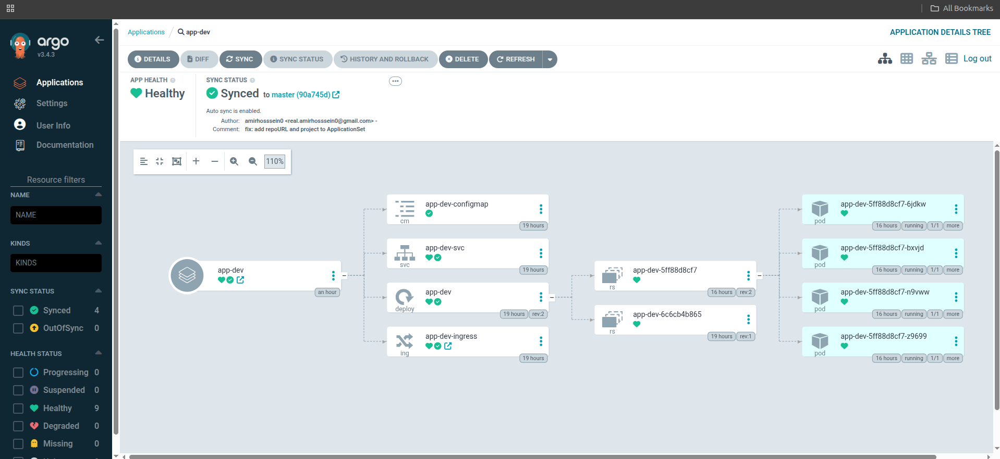
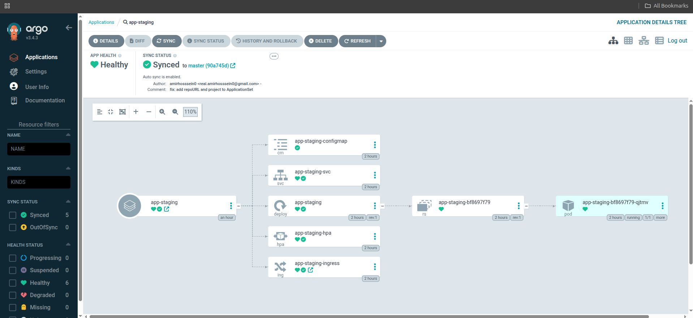

<div align="center">


&nbsp;&nbsp;&nbsp;


# k8s-gitops-lab

**GitOps workflow with Helm & ArgoCD on Kubernetes**


</div>

---

## What is this?

A production-grade GitOps lab that demonstrates end-to-end Kubernetes deployment using Helm and ArgoCD.

A simple Go/Gin API is packaged as a Helm chart and deployed to two environments — `develop` and `staging` — via ArgoCD's **App of Apps** pattern using an **ApplicationSet**.

---

## Architecture

```
app-of-apps.yaml
    └── ApplicationSet (argocd/)
            ├── app-dev      → helm/app-chart + gitops/dev/values.yaml     → develop namespace
            └── app-staging  → helm/app-chart + gitops/staging/values.yaml → staging namespace
```

**One commit to git → ArgoCD syncs both environments automatically.**

---

## Stack

| Tool | Role |
|---|---|
| **Go + Gin** | Simple API with `/health`, `/ready`, `/version` |
| **Docker** | Multi-stage image build |
| **Helm v3** | Kubernetes packaging — chart written from scratch |
| **ArgoCD** | GitOps continuous delivery |
| **ApplicationSet** | Generates multi-environment apps from a single template |
| **App of Apps** | Single entry point manages all ArgoCD applications |
| **Traefik** | Ingress controller (built into k3s) |
| **k3s** | Local Kubernetes cluster |

---

## Helm Chart Features

Chart written from scratch — no `helm create` scaffolding.

- `Deployment` with configurable replicas, image, and environment
- `Service` with configurable type and port
- `Ingress` with TLS and className support
- `ConfigMap` for environment injection via `envFrom`
- `HPA` — Horizontal Pod Autoscaler (CPU + Memory)
- `_helpers.tpl` — shared labels via named templates
- `livenessProbe` + `readinessProbe` on `/health` and `/ready`
- `securityContext` — non-root, read-only filesystem, dropped capabilities
- `imagePullSecrets` — private registry support
- `resources` — CPU/memory requests and limits

---

## Repository Structure

```
k8s-gitops-lab/
├── app-of-apps.yaml          ← single apply to bootstrap everything
├── app/
│   ├── main.go               ← Go/Gin API
│   ├── Dockerfile
│   └── .dockerignore
├── argocd/
│   └── applicationset.yaml   ← generates app-dev and app-staging
├── gitops/
│   ├── dev/values.yaml       ← dev environment overrides
│   └── staging/values.yaml   ← staging environment overrides
└── helm/
    └── app-chart/
        ├── Chart.yaml
        ├── values.yaml
        └── templates/
            ├── _helpers.tpl
            ├── configmap.yaml
            ├── deployment.yaml
            ├── hpa.yaml
            ├── ingress.yaml
            └── service.yaml
```

---

## Screenshots

### All Applications — Healthy & Synced


### App of Apps Tree


### app-dev Resources


### app-staging Resources


---

## How to Run

### Prerequisites

- [k3s](https://k3s.io/) or any Kubernetes cluster
- [Helm v3](https://helm.sh/docs/intro/install/)
- [kubectl](https://kubernetes.io/docs/tasks/tools/)
- Docker Hub account

### 1. Install ArgoCD

```bash
kubectl create namespace argocd
kubectl apply -n argocd -f https://raw.githubusercontent.com/argoproj/argo-cd/stable/manifests/install.yaml
```

### 2. Create Docker Hub secret

```bash
kubectl create secret docker-registry dockerhub \
  --docker-username=<username> \
  --docker-password=<token> \
  --docker-server=https://index.docker.io/v1/ \
  --namespace develop

kubectl create secret docker-registry dockerhub \
  --docker-username=<username> \
  --docker-password=<token> \
  --docker-server=https://index.docker.io/v1/ \
  --namespace staging
```

### 3. Create TLS secret

```bash
# Generate self-signed certificate
openssl req -x509 -nodes -days 365 -newkey rsa:2048 \
  -keyout tls.key -out tls.crt \
  -subj "/CN=app-chart.local"

# Create secret in both namespaces
kubectl create secret tls app-chart-tls \
  --cert=tls.crt --key=tls.key \
  --namespace develop

kubectl create secret tls app-chart-tls \
  --cert=tls.crt --key=tls.key \
  --namespace staging

# Remove local files — never commit these
rm tls.crt tls.key
```

### 5. Bootstrap with App of Apps

```bash
kubectl apply -f app-of-apps.yaml
```

ArgoCD will automatically create both environments from git.

### 6. Access ArgoCD UI

```bash
kubectl port-forward svc/argocd-server -n argocd 8080:443
```

### 7. Add local DNS

```bash
echo "127.0.0.1 dev.app-chart.local staging.app-chart.local" | sudo tee -a /etc/hosts
```

---

## GitOps Flow

```
git push
    └── ArgoCD detects change (auto-sync)
            └── helm template + apply
                    ├── develop namespace updated
                    └── staging namespace updated
```

No manual `helm upgrade` needed — git is the single source of truth.

---

## API Endpoints

| Endpoint | Description |
|---|---|
| `GET /health` | Liveness check — returns `{ "status": "up" }` |
| `GET /ready` | Readiness check — returns `{ "status": "ready" }` |
| `GET /version` | App version and environment |

---

<div align="center">
<sub>Built as part of a DevOps portfolio — next up: <a href="#">vault-cicd-lab</a></sub>
</div>